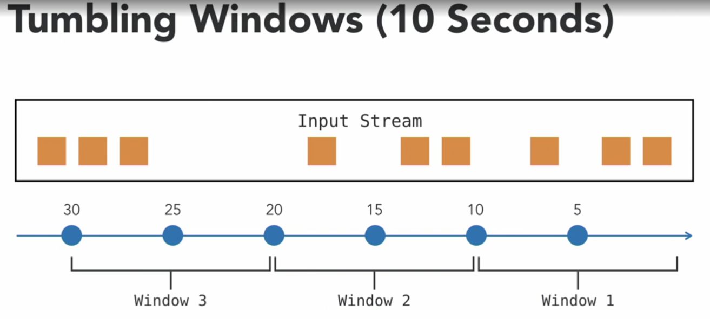
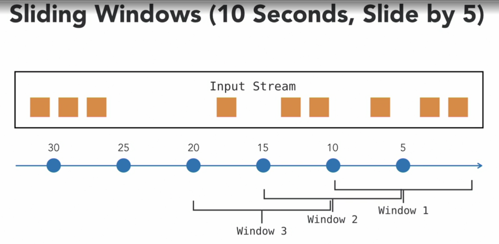
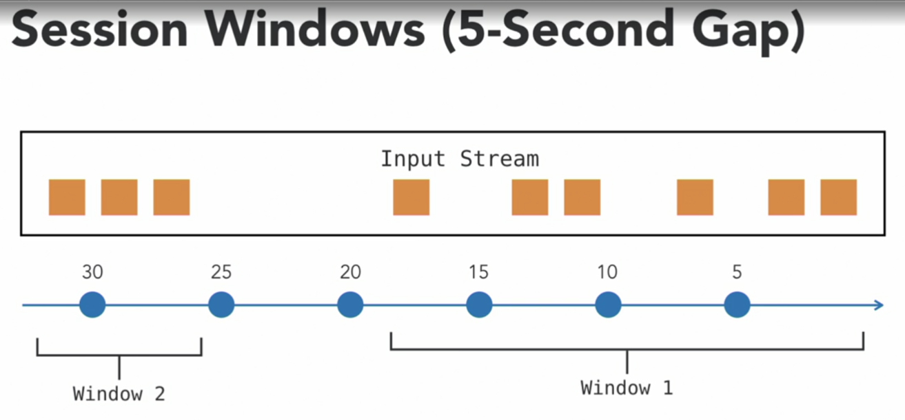

**Windowing** allows grouping of stream events into buckets based on time for aggregation and analytics purpose.

1. The first type of window is a **Tumbling Window**. A Tumbling Window is an equal sized, continuous, and non-overlapping window. Here is an example of how a Tumbling Window looks like for a 10-second interval. 

In this data stream, all events from 0 second to the 10th second fall into Window 1, events from the 10th second to the 20th second fall into Window 2, the same process repeats for the entire stream. This is the default type of window.

2. **Sliding Windows** are overlapping windows. It takes two parameters: *window interval* and *sliding offset*. 

This is an example of a Sliding Window of 10 seconds that slides by 5 seconds. All events from 0 second to the 10th second fall into Window 1. The second window is between the 5th and the 15th second. The third window will be from the 10th to the 20th second.

3. A **Session Window** covers all events that occur between *session boundaries*. Session boundaries are defined based on a period of inactivity or no event. Here is an example for a Session Window with a 5-second gap.

As long as the events occur within 5 seconds of each other, they continue belonging to the same session. In this case, there is a gap in the events from the 19th second to the 26th second, which is longer than 5 seconds, so the first window ends and the second window starts.

4. A **Global Window** takes the entire stream as one single window.

Flink allows creating custom windows with user-defined logic for determining window boundaries.