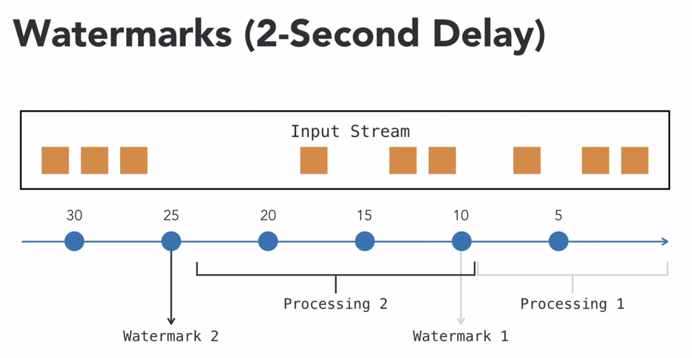

Event Time is the most appropriate timestamp to use for windowing. But how do we know whether all the events for a given time window has arrived at the processing function? What if some of them are still in transit while we compute summary for the window? We can solve this problem using **Watermark**.

Watermarks are timestamps that are used in event-time processing to determine when the events should be processed. Events that arrive at the processing node will wait for the watermark to happen, before they can be processed. When a watermark happens, all events that arrived between the previous watermark and the current watermark will get processed. Watermarks can be either periodic or based on custom logic. Watermarks can also have **delay buffer**, which allows for a delay in processing to account for latency from the source to the processing function.

Here is an example of using watermarks with delay buffer. Note that Event Time is used for the events themselves and windowing, while **watermarks are always based on the processing function clock**.

The delay of 2 seconds means that the watermark assumes every event takes 2 seconds from the source to arrive at the processing function. It gives a 2-second buffer for events to arrive if they are not already there. When the watermark occurs, any events happening in the last 2 seconds are not processed.

The first watermark occurs at the 10th second, so all events with the Event Time from 0 second to the 8th second will get processed for this watermark. The second watermark occurs at the 25th second, then all events from the 9th second to the 23rd second will get processed.

Watermarks ensure consistency and accuracy of results, but they also introduce delays in processing. For a pipeline design, **cache** should be taken to choose the watermark so that it accounts for transit delays and also does computations within required latency thresholds.