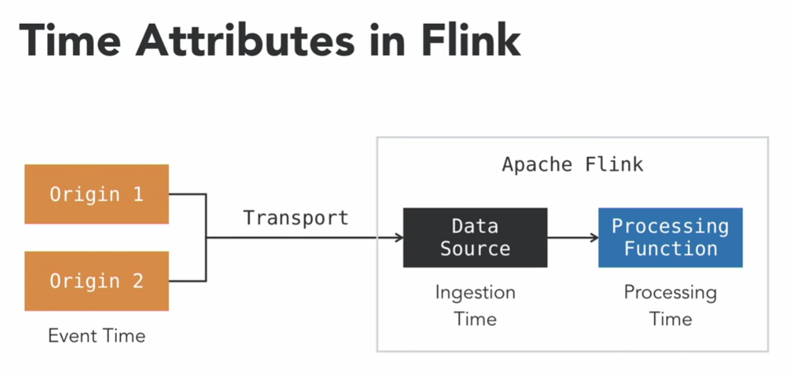

In a stream processing pipeline, there are multiple sources which may contribute to the same incoming data stream, and multiple Flink task slots that process them in parallel. The source of the timestamp used by windowing plays a critical role in determining the outcomes of windowing.

There is latency between the source nodes where they events are generated and the processing nodes where they are finally processed. There can also be latency differences between various sources, so events generated at the same time on two source nodes can arrive at the processing node at different times. To solve the problem, Flink provides 3 different **time attributes** that can be used for stream processing.

Let's say we have a pipeline with 2 origin applications generating events and timestamping them with their own clocks. This kind of timestamp is called **Event Time**. A transport layer, like Kafka, then carries the data to a Flink cluster. Inside Flink, a Data Source operation consumes the incoming data. This timestamp is called **Ingestion Time**. Then, there can be a series of processing functions that can work on this data. The time when the processing node works on this data is called **Processing Time**. Flink allows using any kind of these timestamps for windowing.

1. **Event Time** is the timestamp when a given event is created at the source. Event Time is carried as part of the event. This is the most appropriate time to use for windowing since it is the closest to the application activating. However:
- There can be latency between the origin and the processing function due to the transport layer (for example, Kafka).
- It is possible that the same timestamps from different origins can arrive at the processing function at different times.
- Events can also be out of order due to multiple origins or Flink parallelism.

A solution to this is using **[Watermark](About%20Watermark.md)**. 

2. **Processing Time** is the timestamp based on the system clock on the processing node of Flink. Even if two events are generated at the same time, they can have different processing timestamps if they land in different task slots.

3. **Ingestion Time** are rarely used in Flink as they have very few use cases. The choice between event times and processing times depends on various factors which we will review in the later videos in this chapter.